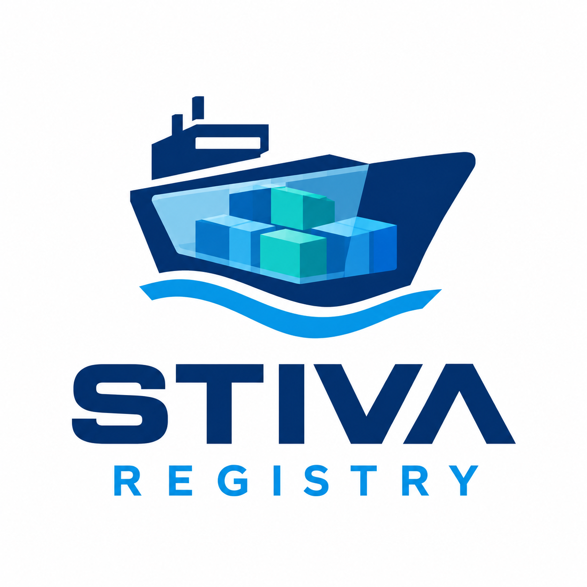

# Stiva

<p align="center">
  
</p>

[](LICENSE)
[](go.mod)
[](web/package.json)

**Stiva is a Nexus/Artifactory-style artifact registry that speaks the OCI
Distribution API** — the same protocol as Docker Hub and GHCR, so every
standard container client works unchanged — **plus 25 more package formats**
(Maven, npm, PyPI, Helm, Go, NuGet, APT, YUM, …) behind one server, one auth
model and one web UI.

Registries come in four types — `hosted`, `proxy`, `group`, `cache` — and can
share a host through virtual hostnames, dedicated ports and URL base paths,
with deterministic longest-match routing.

Coming from Nexus, Artifactory or Harbor? See [how Stiva
compares](docs/COMPARISON.md).

> Status: production-shaped and used daily, under active development. The OCI
> surface is fully functional; see [ROADMAP.md](./ROADMAP.md) for what's next.

## Background

Stiva was born from a concrete need: managing internal artifacts — container
images, Helm charts, Maven/npm packages and the other formats used in
production — without the operational weight of a traditional repository
manager. It started as a lean alternative to Sonatype Nexus OSS, keeping its
registry model (`hosted`/`proxy`/`group`) but rethought for Kubernetes.

The goal was a tool that stays lean and definitive for any Kubernetes
installation, solving once and for all the eternal problem of container image
availability: a transparent pull-through cache in front of every cluster,
images pre-warmed on the nodes, and a registry able to host its own images —
because delivery infrastructure must stand on its own feet.

Those roots show in the architecture: a single static binary instead of a JVM
stack, metadata on PostgreSQL, blobs on any object storage, and modern
authentication (OIDC/SSO alongside LDAP) instead of username and password
alone. It is developed and used in production at Wave Informatica, and
released as open source so that anyone running Kubernetes can benefit from it.

## Features

- Full **OCI Distribution API** (`/v2/…`): resumable blob uploads, manifest
  push/pull/delete, tag listing, content digests, bearer-token flow.
- **26 package formats**: OCI plus Maven, npm, PyPI, Helm, Go, raw, NuGet,
  RubyGems, Composer, Conda, APT, YUM, Conan, CocoaPods, CRAN, ELPA, p2, opkg,
  Chef, Puppet, Vagrant, SBT, Ivy, Gradle and git-lfs — with hosted metadata
  generated on demand (see [Package formats](#package-formats)).
- Registry types: `hosted` (local storage), `proxy` (pull-through cache with
  optional write-through), `group` (ordered read aggregation across members),
  `cache` (transparent multi-upstream pull-through mirror, OCI only).
- **Metadata in PostgreSQL** (required), schema managed by embedded
  `golang-migrate` migrations applied on startup.
- **Pluggable blob storage**: local filesystem, AWS S3 (and S3-compatible),
  Google Cloud Storage, Azure Blob Storage — as named stores shared by any
  number of registries, with credentials encrypted in the built-in vault.
- **Authentication**: local users (bcrypt) + LDAP/Active Directory, OIDC and
  OAuth2 token validation, browser **single sign-on** (Microsoft 365, Google,
  GitHub, GitLab, LinkedIn, generic OIDC/OAuth2/CAS/SAML — managed from the UI),
  user-managed **API keys** (usable as client passwords and bearer tokens,
  optionally scoped below the owner's power), optional anonymous access with
  per-identity CIDR filters (e.g. unauthenticated pulls from cluster nodes).
- **Authorization**: role-based access control — a permission vocabulary,
  named roles, and grants binding a subject to a role within a
  `format:registry:pattern` scope.
- Web UI (React + Mantine): **Explorer** with repository treeview, tag and
  manifest detail, global cross-format search, per-format artifact browsers
  with download links, and full administration (registries, stores, users,
  roles, grants, SSO, settings).
- Single static binary (+ companion `registry-warmer` for cache pre-warming),
  distroless container image, Apache-2.0 licensed.

## Quick start

You need Go 1.26+, Node 22 + pnpm for the UI, and PostgreSQL.

```bash
# Metadata store for local dev.
docker compose up -d            # PostgreSQL on :5432 (see docker-compose.yml)

# Backend.
go build -o registry ./cmd/registry
./registry --admin-user admin --admin-pass "change-me-now" &

# Frontend (served from / once built).
cd web && pnpm install && pnpm build && cd ..
REGISTRY_WEB_DIR=web/dist ./registry --admin-user admin --admin-pass "change-me-now"
```

Open `http://localhost:8080`, sign in as `admin`, then:

1. **Blob Stores → New store** (e.g. type `file` with a root directory);
2. **Registries → New registry** (e.g. `hosted` + `oci`) referencing that store;
3. Pull and push:
   ```bash
   docker login localhost:8080 -u admin          # password or API key
   docker tag nginx:latest localhost:8080/myteam/nginx:latest
   docker push localhost:8080/myteam/nginx:latest
   docker pull localhost:8080/myteam/nginx:latest
   ```

For development with hot reload: `cd web && pnpm dev` (dev server on :5173,
proxying `/v2` and `/api` to :8080).

## Configuration

Resolved as **defaults → JSON file (`-config` / `REGISTRY_CONFIG`) → flags →
env**. See [`config.example.json`](./config.example.json) for a full example.

| Flag / Env | Description |
|------------|-------------|
| `-postgres` / `REGISTRY_POSTGRES` | PostgreSQL DSN (metadata). **Required.** |
| `-listen` | HTTP listen address (default `:8080`). |
| `-uploads` / `REGISTRY_UPLOADS` | Local staging dir for in-progress uploads. |
| `-admin-user` / `-admin-pass` | Bootstrap the first local admin (only if no users exist). |
| `REGISTRY_CONFIG` | Path to the JSON config file. |
| `REGISTRY_WEB_DIR` | Directory with the built web UI (default `web/dist`). |
| `REGISTRY_AUTH_SECRET` | HMAC secret for session tokens (auto-generated if empty; set it for restarts and replicas). |
| `REGISTRY_AUTH_TTL` | Session token lifetime (default `24h`). |
| `REGISTRY_TRUSTED_PROXIES` | Trusted `X-Forwarded-For` hops (default `0` = ignore the header). |
| `REGISTRY_VAULT_KEY` | Hex master key (16/24/32 bytes) for the credential vault. Without it, stores needing credentials fail instead of falling back to cleartext. |
| `REGISTRY_DEBUG` | Set (to anything) for gin debug mode. |

Blob storage is **not** configured here: stores are named rows managed from
the UI (`Blob Stores`), each registry references one, and their credentials
live encrypted in the vault.

## Registry routing

On the shared listener a request reaches exactly one registry, most specific
first:

1. **Dedicated TCP port** (`port`) — pinned to that registry, native protocol
   at the root. (Takes effect on process start.)
2. **Virtual host + longest base path** — several path-addressed registries
   (Maven, npm, …) can share one host under prefixes like
   `https://host/maven-central/…`; `base_path` is stripped before storage.
   An empty base path matches everything with the lowest priority, so an OCI
   registry and prefixed artifact registries coexist on one host.
3. **Virtual host alone** (`hosts`).
4. **Default registry** — catches unmatched hosts (at most one).

Overlaps resolve deterministically; exact duplicates (same host + base path,
two defaults) are rejected when saved. OCI clients speak `/v2` at the host
root, so OCI registries always take a host or a port — never a base path.

## Authentication

Password realms (`local`, `ldap`) serve docker clients, the API and the
password form. Token realms (`oidc`, `oauth`) validate IdP-issued bearers
(e.g. GitLab CI JWTs, GitHub tokens) with no browser round-trip.

**Single sign-on** (Administration → Single sign-on, no restart needed) adds
authorization-code login with PKCE for the web UI: Microsoft 365 (tenant +
Entra object IDs for groups), Google (email, no groups), GitHub (login +
organizations as groups), GitLab (incl. self-hosted base URL), LinkedIn
(email, no groups), plus generic OIDC, OAuth2, CAS 2.0 and SAML 2.0 servers.
Client secrets are vault-encrypted and write-only. SAML uses unsigned
AuthnRequests and mandatory signed responses, with audience, recipient and
time window enforced.

**API keys** (the *API keys* page, or Administration → Service Accounts)
authenticate as their owner — as a client password (`docker login -u <name>`)
and as a bearer token — with optional `(role, scope)` restrictions. Every
request must pass the key's restrictions *and* the owner's grants, so a key
can never exceed its owner; sessions minted from a key stay bound to it, and
revocation applies immediately.

**Anonymous access with CIDR filters** covers callers that cannot
authenticate at all — typically Kubernetes nodes pulling images. Anonymous
access is off by default; when enabled, named anonymous identities
(Administration → Anonymous access) each carry their own CIDR allowlist and
their own grants. Address-restricted identities are matched first, so e.g. an
identity limited to the pod CIDR with pull-only grants serves the cluster
while the rest of the world still gets a challenge. Caller addresses are
resolved spoof-safe behind proxies (rightmost untrusted `X-Forwarded-For`
entry, governed by `REGISTRY_TRUSTED_PROXIES`).

## Authorization (RBAC)

Permissions form a fixed vocabulary (`registry:read/write/delete`,
`admin:*`); named **roles** hold permissions; **grants** bind a subject
(`anonymous`, `authenticated`, `user:<name>`, `group:<name>`) to a role
within a scope shaped as `format:registry:pattern` (`*` wildcards, `**`
across path segments), e.g. `docker:prod:team/**`. There is no implicit
fallback: anything not granted is denied. Administrators are whoever holds an
admin permission at global scope — managed under Roles/Grants, never a bypass
flag. API keys additionally pass their own restrictions first (see above).

## Web UI

- **Explorer**: repository treeview with tag/manifest detail and pull
  references (OCI), per-format artifact browsers with downloads, and global
  search that jumps straight into a repository.
- **Administration**: Registries (type, format, routing, blob store,
  proxy/cache/group settings), Blob Stores, Credentials (vault), Users,
  Groups, Roles, Grants, Service Accounts, Anonymous access identities,
  Single sign-on providers, Settings.

## API summary

OCI Distribution: `GET /v2/`, `/v2/{name}/blobs/uploads/`,
`/v2/{name}/blobs/{digest}`, `/v2/{name}/manifests/{ref}`,
`/v2/{name}/tags/list`. Auth: `GET /auth/token` (docker flow),
`GET /auth/me`, `GET /auth/sso[/:id/login][/:id/callback]`.

UI JSON API (`/api/v1`, bearer session required): `me`, `registries`,
`repositories?registry=`, `repositories/…/tags`, `repositories/…/manifests/…`,
`stats`, `browse?registry=`, `search?q=`, `artifact?registry=&path=`,
`account/password`, `account/keys`, `roles`, plus the `/admin/*` surface for
users, service accounts, stores, secrets, roles, groups, grants, anonymous
identities, SSO providers, registries and settings.

## Package formats

Each registry has a `type` (`hosted`/`proxy`/`group`, plus `cache` for OCI
only) and a `format`. Non-OCI artifacts are addressed by request path; hosted
registries synthesize the metadata documents clients expect:

| Format | Generated metadata |
|--------|--------------------|
| `helm` | `index.yaml` |
| `maven` | `maven-metadata.xml` |
| `npm` | package document from stored `package.json` tarballs |
| `pypi` | `simple/` HTML index |
| `go` | `…/@v/list`, `…/@v/*.info` (GOPROXY layout) |
| `nuget` | `v3-flatcontainer/<id>/index.json` |
| `composer` | `p/<vendor>/<pkg>.json` |
| `conda` | `<subdir>/repodata.json` |
| `apt` | `Packages`/`Packages.gz`/`Release` (parsed from `.deb`) |
| `yum` | `repodata/repomd.xml` (parsed from `.rpm` filenames) |
| `cran` | `PACKAGES`/`PACKAGES.gz` |
| `elpa` | `archive-contents` |
| `cocoapods` | `pods.json` / `all_pods.txt` |
| `opkg` | `Packages`/`Packages.gz` (parsed from `.ipk`) |
| `raw`, `rubygems`, `conan`, `p2`, `chef`, `puppet`, `vagrant`, `sbt`, `ivy`, `gradle`, `git-lfs` | stored and served as-is |

`proxy` pulls through from an upstream and caches locally (optional
write-through); `group` aggregates reads across ordered members and writes to
one; `cache` is a transparent multi-upstream pull-through mirror for
Kubernetes (see `deploy/`), warmed on demand or via `registry-warmer`.

### APT repository signing

A hosted APT registry can carry a signing key (Administration → Registries →
edit → Repository signing): the generated `Release` is then also served
clearsigned as `InRelease` and detached as `Release.gpg`, and the public half
is published as `KEY.gpg` for apt's `signed-by=`. Keys are RSA-3072 generated
in the UI, sealed in the vault, rotated by delete-then-create; without a key
`Release` stays unsigned as before. Client side:

```bash
curl -fsSL https://registry.example.com/debian/KEY.gpg \
  | gpg --dearmor | sudo tee /usr/share/keyrings/stiva-debian.gpg > /dev/null
echo "deb [signed-by=/usr/share/keyrings/stiva-debian.gpg] https://registry.example.com/debian/ ./" \
  | sudo tee /etc/apt/sources.list.d/stiva-debian.list
sudo apt-get update
```

Generated `Packages` stanzas carry relative `Filename`s plus `Size`/`SHA256`
(and legacy hashes), so downloads verify against the signed index.

Deleting manifests and artifacts leaves their blobs behind by design (a blob
may still be referenced elsewhere). **Garbage collection** reaps them:
`POST /api/v1/admin/gc` with `{registry?, dry_run?, older_than?}` lists or
deletes blobs that no manifest links and no artifact object embeds — per
registry or everywhere, with a grace period (default `1h`) protecting pushes
still in flight. The Registries admin page offers the same as a preview-then-
run dialog. Dry-run first on any registry that matters.

## Kubernetes deployment

Two starting points live in [`deploy/`](./deploy), both aimed at real clusters
and both expecting you to adapt hosts, storage and secrets:

- [`deploy/registry`](./deploy/registry) — plain manifests with kustomization
  (namespace, ConfigMap, Secret template, PVC, Deployment, ClusterIP `:5000`,
  cache mirror notes, `registry-warmer` job).
- [`deploy/k8s`](./deploy/k8s) — Helm chart with values for image,
  ingress/Istio, external PostgreSQL, MinIO-backed blobs and the warmer.

## Development

```
cmd/registry          → Go entrypoint (gin HTTP server)
cmd/registry-warmer   → cache pre-warm tool
internal/config       → flags + env + JSON file
internal/digest       → sha256 helpers
internal/storage      → PostgreSQL metadata + blob backends (+ embedded migrations)
internal/blobstore    → named blob stores + vault references
internal/vault        → envelope-encrypted credentials (per-entry derived keys)
internal/auth         → local/LDAP/OIDC/OAuth realms, SSO, API keys, sessions
internal/authz        → RBAC engine (permissions, roles, grants, scopes)
internal/registry     → hosted/proxy/group/cache backends, routing
internal/api          → OCI handlers + JSON UI API + admin surface
web/                  → React 19 + Vite + Mantine UI (built into web/dist)
```

```bash
go build ./... && go test ./...      # backend + migrations-safe unit tests
cd web && pnpm install && pnpm build  # typecheck + bundle (tsc && vite build)
```

Migrations (`internal/storage/migrations/`) apply automatically on startup;
`web/dist` is built, never committed.

## Roadmap

Planned and finished work lives in [ROADMAP.md](./ROADMAP.md).

## Contributing

Issues and pull requests are welcome. Please keep changes focused, covered by
tests where the repo already has them (`go test ./...`, `cd web && pnpm build`),
and documented in this README when they alter behavior or configuration.

## Security

If you find a security vulnerability, please contact the maintainers privately
instead of opening a public issue, so a fix can ship before disclosure.

## License

Copyright 2026 Wave Informatica S.r.l.

Licensed under the [Apache License 2.0](./LICENSE).
